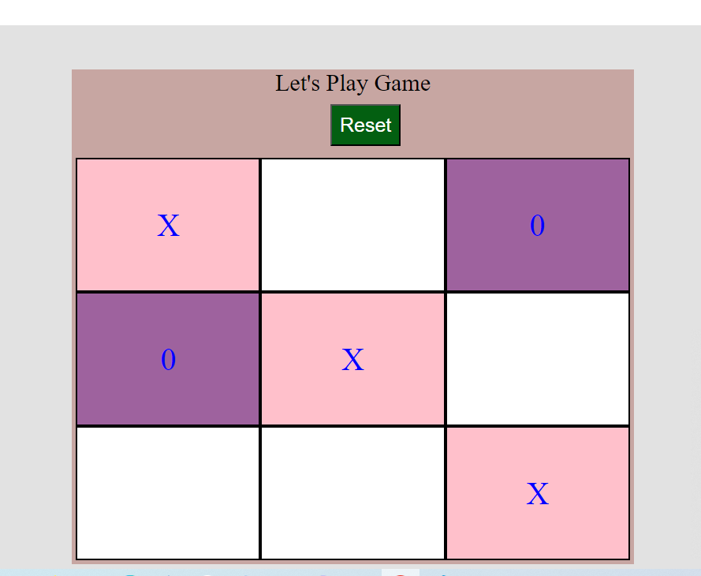

# Tik-Tac-Toe Game

Let's play this game. In this game, there are two players. They both will select alternatively their place of 'X' or 'O' accordingly until they get the same axis 'X' or 'O' or as a cross line. The player who creates the winning pattern first will win the game.

